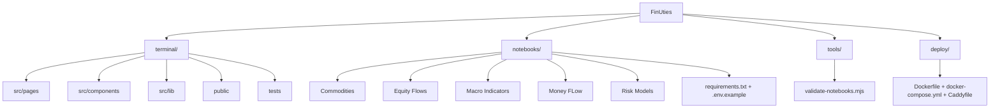

# FinUties

FinUties is the core project. This public repository includes two open-source offerings: `FinUites Terminal Community` (the `terminal/` application built with Astro + SolidJS) and the `notebooks/` collection for API-based analysis workflows in Python. The project is published under the MIT License.

A hosted version is available and accessible online, so you can explore the platform without local setup. Visit `https://www.finuties.com` to access the live environment.

## Project Structure

## Quick Start

### Web Terminal
1. `cd terminal`
2. `npm install`
3. `npm run dev`

### Notebooks
1. Create `notebooks/.env` from `notebooks/.env.example`
2. Install dependencies from `notebooks/requirements.txt`
3. Run the notebooks in your preferred Jupyter environment to query and analyze data from the FinUties API

## Notes

- Notebook safety checks are enforced via `tools/validate-notebooks.mjs` (including secret-pattern checks).
- Keep API keys in local `.env` files only; never commit secrets.
