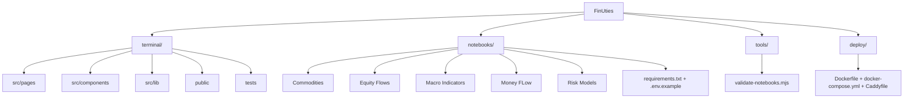

# FinUties

FinUties is the core project. This public repository includes two open-source offerings: `FinUites Terminal Community` (the `terminal/` application built with Astro + SolidJS) and the `notebooks/` collection for API-based analysis workflows in Python. The project is published under the MIT License.

A hosted version is available and accessible online, so you can explore the platform without local setup. Visit `https://www.finuties.com` to access the live environment.

## Project Structure

## Quick Start

### Web Terminal (Docker, cross-platform)
Use this path on a freshly installed OS (macOS, Windows, Linux):
1. Install Docker:
   - macOS/Windows: Docker Desktop
   - Linux: Docker Engine + Docker Compose plugin
2. Clone this repository and enter the terminal app:
   - `git clone https://github.com/techuties/finuties.git`
   - `cd finuties/terminal`
3. Start the terminal container:
   - `docker compose up --build`
4. Open `http://localhost:4321` and connect with your FinUties API key (`fin_sk_...`)
5. Stop the stack when finished:
   - `docker compose down`

Setup walkthrough video:
- `terminal/public/videos/setup-terminal-local-docker.mp4`

### Web Terminal (Node.js, without Docker)
1. `cd terminal`
2. `npm install`
3. `npm run dev`
4. Open the local terminal URL and connect with your FinUties API key (`fin_sk_...`)

### Authentication
- FinUites Terminal Community supports **API key authentication only**.
- No username/password session login is available in the terminal UI.
- Generate or manage keys in `https://www.finuties.com/settings` and paste the key on the terminal connect page.

### Notebooks
1. Create `notebooks/.env` from `notebooks/.env.example`
2. Set `FINUTIES_API_KEY=fin_sk_...` in `notebooks/.env`
3. Install dependencies:
   - `python3 -m pip install -r notebooks/requirements.txt`
4. Start Jupyter from the repository root (recommended) and open any notebook:
   - `jupyter lab`
5. Run cells top-to-bottom; each notebook expects the same `notebooks/.env` API key setup

## Notes

- Notebook safety checks are enforced via `tools/validate-notebooks.mjs` (including secret-pattern checks).
- Keep API keys in local `.env` files only; never commit secrets.
