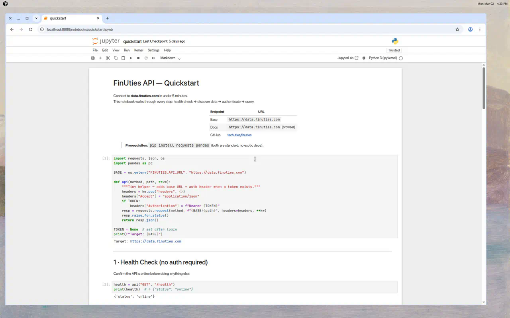
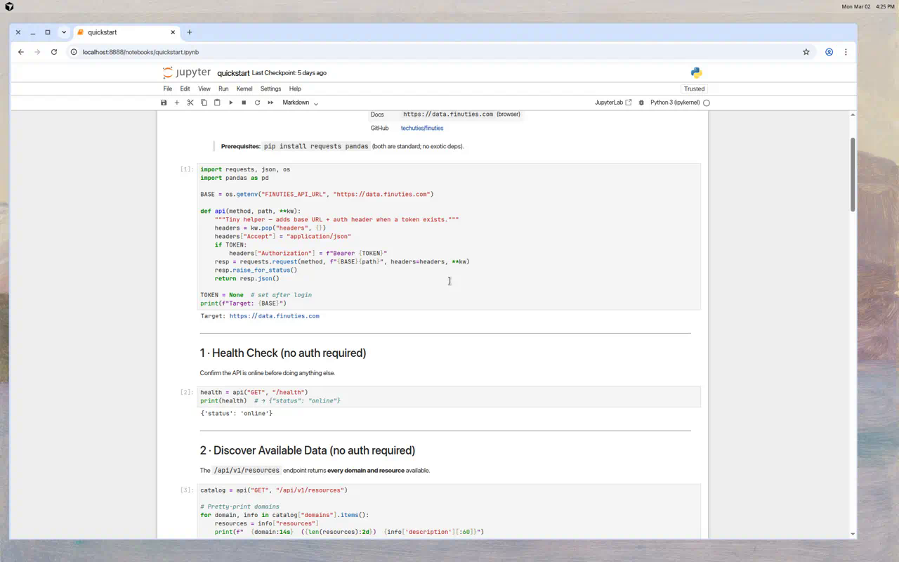
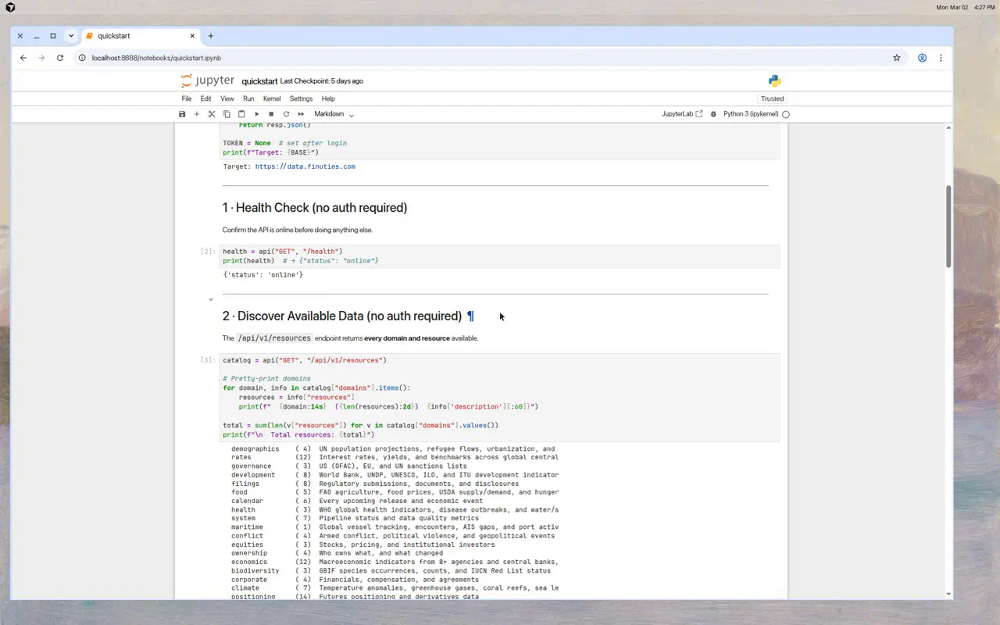
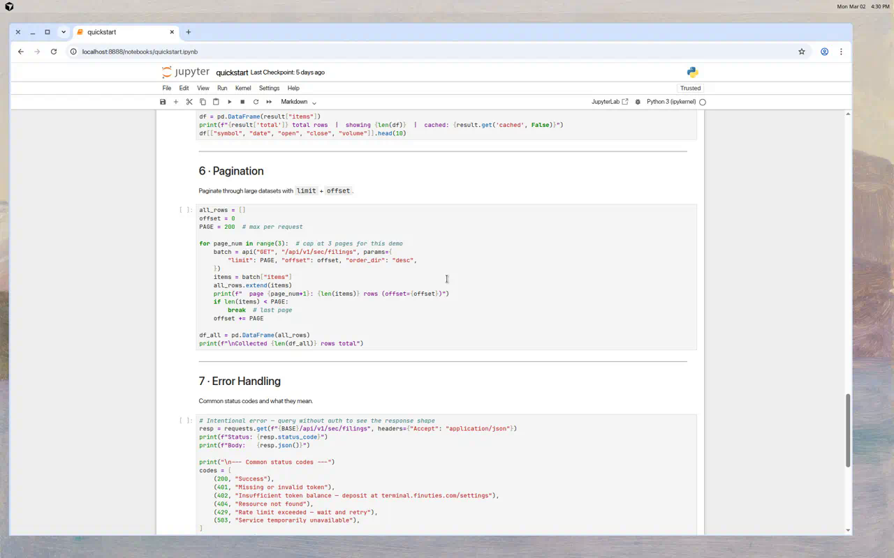

<div align="center">

# FinUties

**Financial data, unified.**

[](LICENSE)
[](https://www.python.org)
[](quickstart.ipynb)
[](https://data.finuties.com/health)

A unified REST API for financial, economic, and alternative data — **108 resources across 18 domains**, one consistent interface.

[Get Started](#-quickstart) · [API Reference](#-api-reference) · [Docs](https://data.finuties.com) · [Sign Up](https://www.finuties.com)

</div>

---

## Overview

FinUties aggregates data from SEC, World Bank, UNDP, FAO, WHO, GBIF, and dozens of other authoritative sources into a single, developer-friendly API. Query SEC filings, stock prices, macroeconomic indicators, climate data, conflict events, and more — all through one base URL with consistent pagination, filtering, and authentication.

<p align="center">
  <a href="assets/demo.mp4">
    
  </a>
</p>

> **Live demo** — The notebook executing step by step against the real API: setup, health check, resource catalog discovery, and error handling. [Watch the video](assets/demo.mp4)

---

## Features

- **108 Resources** across 18 data domains — from SEC filings to coral reef health
- **Unified Query Interface** — consistent `GET` and `POST` patterns for every resource
- **Advanced Filtering** — ranges, IN-lists, column filters, and full-text search
- **Pagination** — `limit` + `offset` for efficient traversal of large datasets
- **Two Auth Methods** — JWT tokens for interactive sessions, API keys for automation
- **Built-in Caching** — response-level cache indicators for performance tuning
- **Zero Dependencies** — standard Python (`requests` + `pandas`) is all you need

---

## Data Domains

| Domain | Resources | Description |
|---|:---:|---|
| **Positioning** | 14 | Futures positioning and derivatives data |
| **Economics** | 12 | Macroeconomic indicators from 8+ agencies and central banks |
| **Rates** | 12 | Interest rates, yields, and benchmarks across global central banks |
| **Development** | 8 | World Bank, UNDP, UNESCO, ILO, and ITU indicators |
| **Filings** | 8 | Regulatory submissions, documents, and disclosures |
| **Climate** | 7 | Temperature anomalies, greenhouse gases, sea level, and ice extent |
| **System** | 7 | Pipeline status and data quality metrics |
| **Calendar** | 6 | Every upcoming release and economic event |
| **Food** | 5 | FAO agriculture, food prices, USDA supply/demand, and hunger data |
| **Demographics** | 4 | UN population projections, refugee flows, urbanization, and migration |
| **Conflict** | 4 | Armed conflict, political violence, and geopolitical events |
| **Corporate** | 4 | Financials, compensation, and agreements |
| **Ownership** | 4 | Who owns what, and what changed |
| **Biodiversity** | 3 | GBIF species occurrences, counts, and IUCN Red List status |
| **Equities** | 3 | Stocks, pricing, and institutional investors |
| **Governance** | 3 | US (OFAC), EU, and UN sanctions lists |
| **Health** | 3 | WHO global health indicators, disease outbreaks, and water/sanitation |
| **Maritime** | 1 | Global vessel tracking, encounters, AIS gaps, and port activity |

---

## Tech Stack

| Component | Technology |
|---|---|
| Language | Python 3.9+ |
| HTTP Client | [Requests](https://docs.python-requests.org/) |
| Data Handling | [Pandas](https://pandas.pydata.org/) |
| Notebook Runtime | [Jupyter Notebook](https://jupyter.org/) |
| API Transport | REST / JSON over HTTPS |
| Authentication | JWT Bearer Tokens · API Keys (`fin_sk_…`) |

---

## Quickstart

### Prerequisites

- **Python 3.9** or higher
- **pip** package manager

### 1. Clone the Repository

```bash
git clone https://github.com/techuties/finuties.git
cd finuties
```

### 2. Install Dependencies

```bash
pip install requests pandas jupyter
```

### 3. Launch the Notebook

```bash
jupyter notebook quickstart.ipynb
```

### 4. Run the Health Check

The first two sections require **no authentication** — run them immediately to verify your setup.

<p align="center">
  
</p>

### 5. Explore the Resource Catalog

Discover all 108 available resources organized by domain:

<p align="center">
  
</p>

### 6. Authenticate (Optional)

To access data endpoints, sign up at [finuties.com](https://www.finuties.com) and authenticate using one of two methods:

**Option A — JWT Login** (interactive sessions):
```python
resp = requests.post(f"{BASE}/api/v1/auth/login", json={
    "username": "your_username",
    "password": "your_password",
})
TOKEN = resp.json()["access_token"]
```

**Option B — API Key** (scripts and automation):
```python
TOKEN = "fin_sk_your_api_key_here"
```

---

## API Reference

### Base URL

```
https://data.finuties.com
```

### Endpoints

| Action | Method | Endpoint | Auth |
|---|---|---|:---:|
| Health check | `GET` | `/health` | No |
| Resource catalog | `GET` | `/api/v1/resources` | No |
| Login (JWT) | `POST` | `/api/v1/auth/login` | No |
| Verify token | `GET` | `/api/v1/auth/verify` | Yes |
| User info | `GET` | `/api/v1/auth/me` | Yes |
| Simple query | `GET` | `/api/v1/{domain}/{resource}` | Yes |
| Advanced query | `POST` | `/api/v1/query` | Yes |
| Latest filings | `GET` | `/api/v1/sec/filings/latest` | Yes |

### Query Parameters (GET)

| Parameter | Type | Description |
|---|---|---|
| `limit` | `int` | Max rows to return (default varies by resource) |
| `offset` | `int` | Number of rows to skip (for pagination) |
| `order_by` | `string` | Column to sort by |
| `order_dir` | `asc` \| `desc` | Sort direction |
| `include_total` | `bool` | Include total row count in response |
| `no_cache` | `bool` | Bypass response cache |
| _any column_ | `string` | Filter by exact column value |

### Request Body (POST `/api/v1/query`)

```json
{
  "domain":        "market",
  "resource":      "stock-prices",
  "filters":       { "column": "value" },
  "in_filters":    { "symbol": ["AAPL", "MSFT", "GOOG"] },
  "ranges":        { "date": { "gte": "2024-01-01" } },
  "limit":         30,
  "offset":        0,
  "order_by":      "date",
  "order_dir":     "desc",
  "include_total": true
}
```

### Status Codes

| Code | Meaning |
|---|---|
| `200` | Success |
| `401` | Missing or invalid token |
| `402` | Insufficient token balance |
| `404` | Resource not found |
| `429` | Rate limit exceeded — wait and retry |
| `503` | Service temporarily unavailable |

<p align="center">
  
</p>

---

## Usage Examples

### Simple GET Query — Latest SEC Filings

```python
filings = api("GET", "/api/v1/sec/filings", params={
    "limit": 5,
    "order_dir": "desc",
})

df = pd.DataFrame(filings["items"])
df[["cik", "form_type", "filed_at"]].head()
```

### Advanced POST Query — Stock Prices

```python
result = api("POST", "/api/v1/query", json={
    "domain":     "market",
    "resource":   "stock-prices",
    "in_filters": {"symbol": ["AAPL", "MSFT", "GOOG"]},
    "order_by":   "date",
    "order_dir":  "desc",
    "limit":      30,
    "include_total": True,
})

df = pd.DataFrame(result["items"])
df[["symbol", "date", "open", "close", "volume"]].head(10)
```

### Pagination

```python
all_rows = []
offset = 0
PAGE = 200

while True:
    batch = api("GET", "/api/v1/sec/filings", params={
        "limit": PAGE, "offset": offset, "order_dir": "desc",
    })
    items = batch["items"]
    all_rows.extend(items)
    if len(items) < PAGE:
        break
    offset += PAGE

df = pd.DataFrame(all_rows)
print(f"Collected {len(df)} rows")
```

---

## Environment Variables

| Variable | Default | Description |
|---|---|---|
| `FINUTIES_API_URL` | `https://data.finuties.com` | Override the API base URL |

---

## Project Structure

```
finuties/
├── quickstart.ipynb   # Interactive quickstart notebook
├── assets/            # Screenshots and demo video
│   ├── demo.mp4
│   ├── hero.png
│   ├── health_check.png
│   ├── resource_catalog.png
│   └── error_handling.png
├── LICENSE            # MIT License
└── README.md          # This file
```

---

## Contributing

1. Fork the repository
2. Create a feature branch (`git checkout -b feature/my-feature`)
3. Commit your changes (`git commit -m 'Add my feature'`)
4. Push to the branch (`git push origin feature/my-feature`)
5. Open a Pull Request

---

## License

This project is licensed under the **MIT License** — see the [LICENSE](LICENSE) file for details.

---

<div align="center">

**FinUties** — financial data, unified.

[Website](https://www.finuties.com) · [API Docs](https://data.finuties.com) · [GitHub](https://github.com/techuties/finuties)

Copyright &copy; 2025 TechUties

</div>
