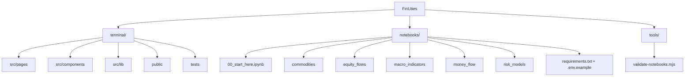

# FinUties

FinUties is public-market data for you — one governed REST and MCP contract over filings, ownership, equities, positioning, rates, economics, calendar, and pipeline health, with published freshness.

This repo is the open Terminal and notebooks; the hosted product is at [www.finuties.com](https://www.finuties.com) (API: [data.finuties.com](https://data.finuties.com), Terminal: [terminal.finuties.com](https://terminal.finuties.com)).

Developed by TechUties.

## This directory

This folder **is** the public GitHub working tree (`techuties/finuties`). Public work lives here: `terminal/` (community Terminal) and `notebooks/`. Develop the public Terminal **in this folder** — it is a community subset, not a symlink of the private hosted app.

If this checkout is `finuties-public/` inside the private monorepo: the private Terminal is `../edge/terminal/` (different app; do not merge blindly). The private tree gitignores `finuties-public/` on purpose.

## What you need

- Python 3.12
- A FinUties API key
- Node.js only if you run the Terminal locally

## 1. Clone

```bash
git clone https://github.com/techuties/finuties.git
cd finuties
```

## 2. Install Python 3.12 packages

```bash
python3.12 -m pip install -r notebooks/requirements.txt
```

## 3. Get a sandbox key

```bash
curl -sS -X POST https://data.finuties.com/api/v1/auth/sandbox
```

Copy the JSON `key` field (it starts with `fin_sk_`). Sandbox keys expire in about 72 hours. For a longer-lived key, use [finuties.com/settings](https://www.finuties.com/settings).

## 4. Write `notebooks/.env`

```bash
cp notebooks/.env.example notebooks/.env
```

Set one line:

```
FINUTIES_API_KEY=fin_sk_...
```

## 5. Open the notebooks

From the repository root:

```bash
jupyter lab notebooks/00_start_here.ipynb
```

Run cells top to bottom. Start with `00_start_here.ipynb`.

### Notebooks

| Notebook | What it does | Live endpoint |
| --- | --- | --- |
| `notebooks/00_start_here.ipynb` | Key check, `/health`, `/api/v1/status/p0`, recipes, one query | `/health`, `/api/v1/status/p0`, `/api/v1/recipes`, `/api/v1/cftc/legacy_futures-facts` |
| `notebooks/money_flow/latest_cot_data_example.ipynb` | Wheat COT net positioning and 26-week z-score | `/api/v1/cftc/legacy_futures-facts` |
| `notebooks/commodities/commodities_snapshot_baseline.ipynb` | Brent price, returns, 12-month vol | `/api/v1/development/wb-commodity-prices` |
| `notebooks/macro_indicators/macro_series_baseline.ipynb` | CPI-U EWMA and 12-month change | `/api/v1/data/economic/bls` |
| `notebooks/equity_flows/equity_flow_baseline.ipynb` | 13F top-company concentration | `/api/v1/holdings/top-companies` |
| `notebooks/risk_models/volatility_regime_baseline.ipynb` | Crypto 24h risk snapshot | `/api/v1/data/crypto/prices` |

## 6. Optional: Terminal

```bash
cd terminal
npm install
npm run dev
```

Open the local URL and paste the same `fin_sk_...` key. With no extra env, the client calls `https://data.finuties.com`. Copy `terminal/.env.example` to `terminal/.env` only if you need to override that.

The Terminal uses API-key authentication only (no username/password in this app).

## Project structure


```mermaid
flowchart TD
    A[FinUties] --> B[terminal/]
    A --> C[notebooks/]
    A --> D[tools/]

    B --> B1[src/pages]
    B --> B2[src/components]
    B --> B3[src/lib]
    B --> B4[public]
    B --> B5[tests]

    C --> C0[00_start_here.ipynb]
    C --> C1[commodities]
    C --> C2[equity_flows]
    C --> C3[macro_indicators]
    C --> C4[money_flow]
    C --> C5[risk_models]
    C --> C6[requirements.txt + .env.example]

    D --> D1[validate-notebooks.mjs]
```

## Notes

- MIT License (see `LICENSE`).
- Keep keys in local `.env` files. Never commit them.
- `tools/validate-notebooks.mjs` rejects secrets and empty code cells.
- `/api/v1/data/commodities/prices` and `/api/v1/data/macro/series` are not live routes (404). The notebooks above use endpoints that returned 200 when checked.
