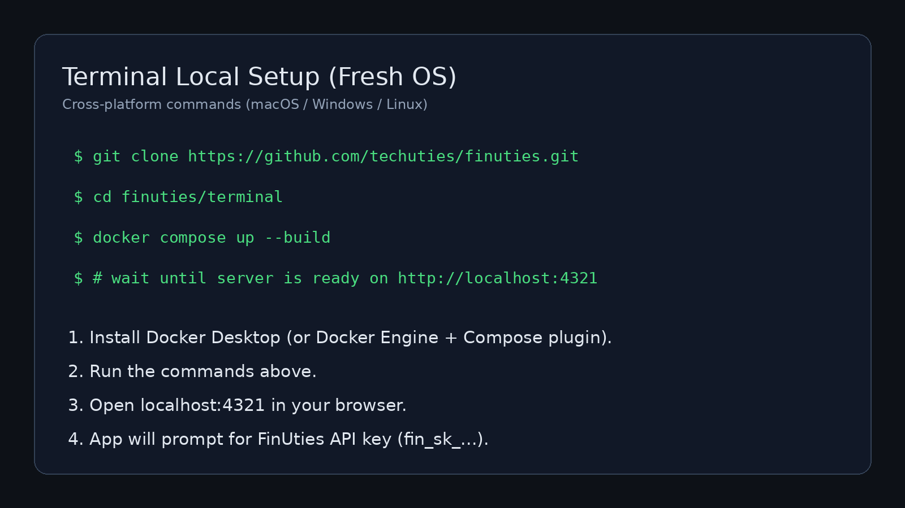
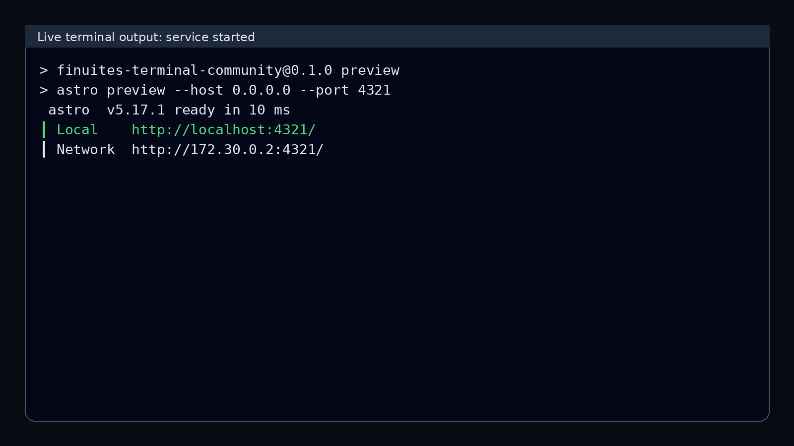
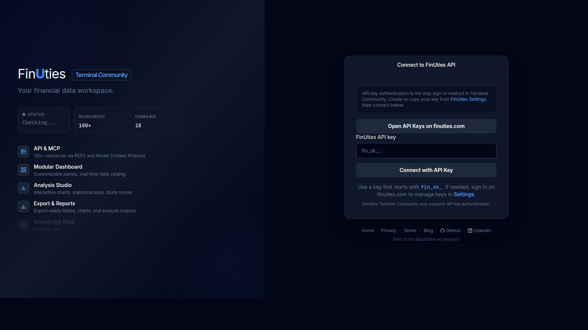

# FinUties Terminal Community

This guide shows how to set up the Terminal locally on a fresh machine, using a Docker workflow that works across macOS, Windows, and Linux.

Authentication in Terminal Community is **API key only** (`fin_sk_...`).

## Live Setup Walkthrough (Video)

<video src="docs/assets/terminal-live-setup-walkthrough.mp4" controls width="960">
  Your browser does not support embedded videos. Download:
  <a href="docs/assets/terminal-live-setup-walkthrough.mp4">terminal-live-setup-walkthrough.mp4</a>
</video>

The video walks through setup from a clean environment until the UI requests your API key.

## Screenshots

### 1) Setup commands (cross-platform flow)


### 2) Service running locally


### 3) API key is required on login


## Fresh OS Setup (Docker, recommended)

### Prerequisites
- Docker Desktop (macOS/Windows), or
- Docker Engine + Docker Compose plugin (Linux)
- Git

### Steps
1. Clone the repository:
   ```bash
   git clone https://github.com/techuties/finuties.git
   ```
2. Move into the terminal app:
   ```bash
   cd finuties/terminal
   ```
3. Start the service:
   ```bash
   docker compose up --build
   ```
4. Open:
   - `http://localhost:4321`
5. Connect with your FinUties API key:
   - format: `fin_sk_...`
   - create/manage keys: `https://www.finuties.com/settings`

### Stop the service
```bash
docker compose down
```

## Notes
- Terminal Community supports **API key login only**.
- Default API origin is `https://data.finuties.com`.
- If port `4321` is already in use, change the host port mapping in `docker-compose.yml` (for example `4322:4321`).

